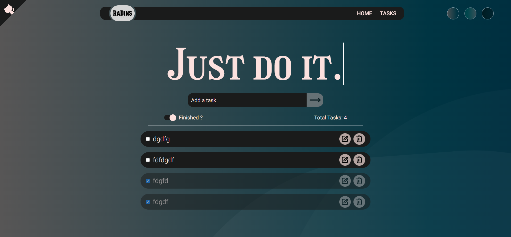
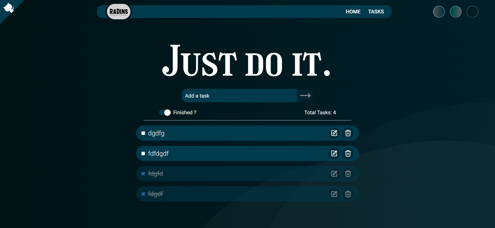
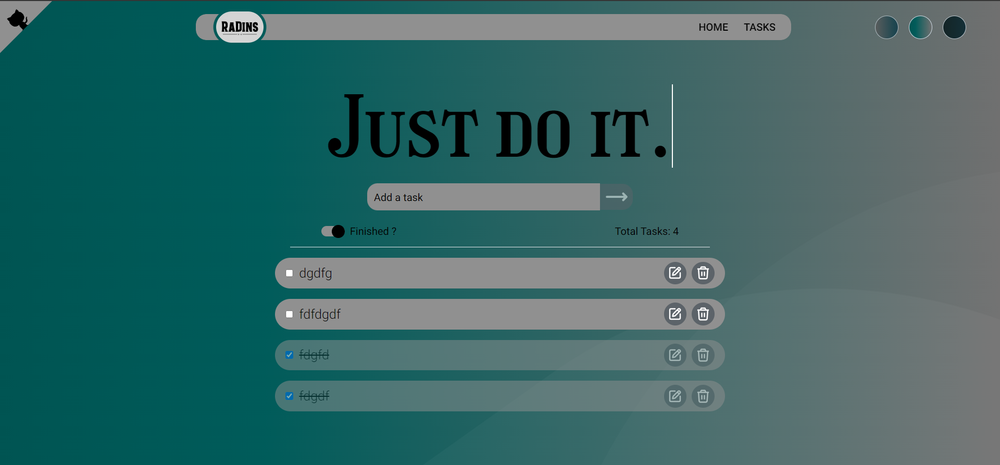
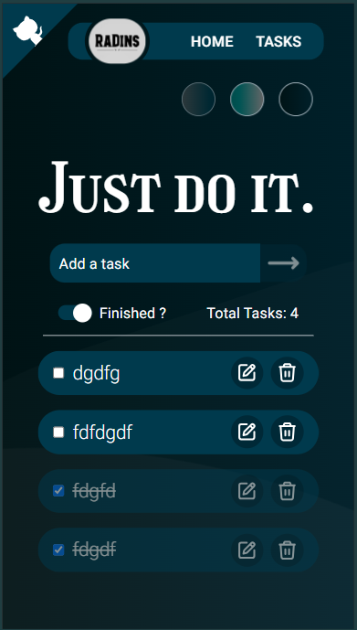

# To-Do-List

## *WEBSITE DEMO*

## A Simple To - Do Website!

#### This web page is hosted [here!](https://you-can-it.netlify.app/tasks)

- View the local installation in the [CONTRUBUTING.md](https://github.com/RaDins-18/ToDoList-App-Using-React-Tailwind-JavaScript/blob/main/CONTRIBUTING.md).

### *Features*:

* User-friendly
* CRUD Operations
* Local Storage Supported
* Responsive, on all devices
* Themes: Users can choose among different themes.

### *Features to be added*:

Check [Issues](https://github.com/RaDins-18/ToDoList-App-Using-React-Tailwind-JavaScript/issues) for contributing to this repository.

* SubTasks: Adding subtasks to the enlisted tasks, could be an option.
* Neumorphic Interface: For the to-do's so, it looks more appealing, Can use SASS (.scss file)
* ScratchPad: Adding an option of a Scratch pad and it can be locally saved.
* Login Features (use APIs) & Database: So the website can be opened on any device, users can log in, and the To-Dos can be viewed anywhere, anytime.
* Reminder/Alerts: Sending automated mails once logged in, and due date/time set.

# *Contributions*

- All contributors are most welcome! This is definitely open source!
- View the [`CONTRIBUTING.md`](https://github.com/RaDins-18/ToDoList-App-Using-React-Tailwind-JavaScript/blob/main/CONTRIBUTING.md) for further instructions, requirements/dependencies & local project setup instructions!

# *Author*

* RaDins (radinofficial15@gmail.com)
  - [Instagram](https://www.instagram.com/radinsterritory/)